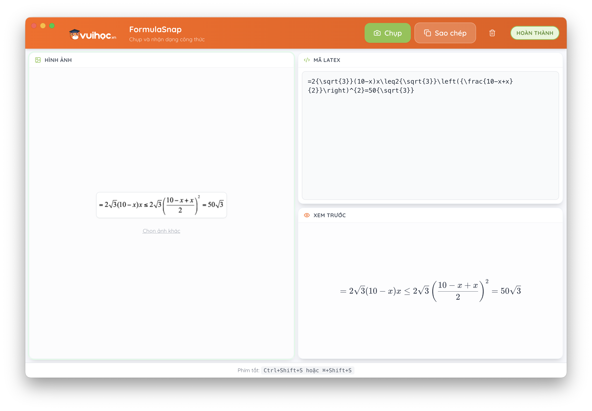

# FormulaSnap

<p align="center">
  
</p>

**FormulaSnap** là ứng dụng desktop đa nền tảng được thiết kế để chụp vùng màn hình và nhận dạng công thức toán học thành mã LaTeX ngay lập tức.


## ✨ Highlights

- 🚀 **Nhẹ & Nhanh:** Sử dụng model OCR chỉ 20M tham số, chạy trực tiếp trên trình duyệt/ứng dụng mà không cần GPU
- 🔒 **Bảo mật:** Xử lý hoàn toàn offline, dữ liệu không được gửi lên server
- 🎯 **Chính xác:** Dựa trên model SOTA với độ chính xác cao trên các công thức phức tạp
- 💻 **Đa nền tảng:** Hỗ trợ Windows, macOS và Linux

## 🧠 OCR Model - Texo

FormulaSnap sử dụng model [**Texo**](https://github.com/alephpi/Texo) - một model LaTeX OCR mã nguồn mở tiên tiến:

| Đặc điểm | Mô tả |
|----------|-------|
| **Kích thước** | Chỉ ~20M tham số |
| **Hiệu năng** | BLEU score ~0.86 trên UniMERNet-Test |
| **Kiến trúc** | Vision Encoder-Decoder (distilled từ PPFormulaNet-S) |
| **Inference** | Chạy trực tiếp trên trình duyệt với ONNX Runtime Web |

## 🚀 Tính năng

- **Chụp màn hình:** Chọn bất kỳ vùng nào trên màn hình để chụp
- **Nhận dạng công thức:** Tự động chuyển đổi hình ảnh thành mã LaTeX
- **Hỗ trợ đa màn hình:** Hoạt động liền mạch trên nhiều màn hình
- **System Tray:** Truy cập nhanh qua biểu tượng trên thanh hệ thống
- **Xem trước trực tiếp:** Xem trước công thức LaTeX được render theo thời gian thực
- **Sao chép nhanh:** Sao chép mã LaTeX chỉ với một click

## 🛠️ Cài đặt

1. **Clone repository:**
   ```bash
   git clone <repository-url>
   cd FormulaSnap
   ```

2. **Cài đặt dependencies:**
   ```bash
   npm install
   ```

## 💻 Development

Chạy ứng dụng ở chế độ development với hot-reload:

```bash
npm run electron:dev
```

## 📦 Build

Tạo file cài đặt/chạy cho môi trường production:

```bash
npm run electron:build
```

Các file đầu ra (DMG, Zip, v.v.) sẽ được tạo trong thư mục `release`.

## 🔧 Tech Stack

| Thành phần | Công nghệ |
|------------|-----------|
| **Framework** | Electron + React + TypeScript |
| **Giao diện** | Tailwind CSS |
| **OCR Engine** | Texo (ONNX Runtime Web) |
| **Render toán học** | KaTeX |
| **Build Tool** | Vite |
| **Đóng gói** | electron-builder |

## 📂 Project Structure

```
FormulaSnap/
├── src/                    # Mã nguồn React (giao diện)
│   ├── components/         # Các React components
│   ├── lib/                # Thư viện OCR wrapper
│   └── workers/            # Web Workers xử lý OCR
├── electron/               # Mã nguồn Electron main process
├── dist/                   # Assets đã build (renderer)
├── dist-electron/          # Assets đã build (main process)
└── release/                # File cài đặt đã đóng gói
```

## 🙏 Acknowledgements

- [Texo](https://github.com/alephpi/Texo) - Model LaTeX OCR mã nguồn mở
- [ONNX Runtime Web](https://github.com/microsoft/onnxruntime) - Engine inference
- [KaTeX](https://katex.org/) - Thư viện render công thức toán
- [Electron](https://www.electronjs.org/) - Framework ứng dụng desktop

## 📄 License

MIT License - Xem file [LICENSE](LICENSE) để biết thêm chi tiết.
